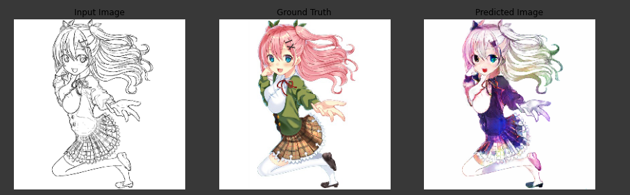
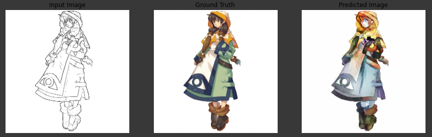
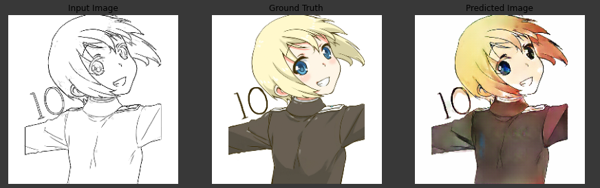

# Anime_sketch_colorisation

This repository contains implementation of the CVPR - 2017 Paper "Image-to-Image Translation with Conditional Adversarial Networks".
The code is written in Python 3.7 and trained on Intel(R) Xeon(R) CPU @ 2.20GHz with Nvidia Tesla T4 15GB GPU
Part of Winter of GANs

## Generator
The architecture is of U-Net kind, which takes input as a sketch images of size (256 X 256 X 3) and outputs a coloured image of size (256 X 256 X 3). Encoder layer consists of 8 layers which convert images into latent space of size (1 X 1 X 512). Decoder contains 7 layer which upsamples the image. L1 loss is used to the generator along with the cGan loss

## Discriminator
It takes sketch as well as coloured images a input and stack one on another. It return the probability that given the sketch, does the coloured image belongs to it or not.

## Training
<a href="https://drive.google.com/file/d/1HREH_KguTN_Iyp94wBfLtHm9yjgxzE5T/view?usp=sharing">click here </a> for getting the model weights.
The model has been trained for 280 epochs, and the checkpoints can be found <a href="https://drive.google.com/drive/folders/1mFLO1OliYMRU3P8ORnFtWuWi5jvK37Iw?usp=sharing">here</a> if someone wishes to continue the training.

Link to the code in colab can be found . Make a copy of the colab notebook in your drive and tinker around!!

## Results

Some of the results

Made with ❤ by Bhuvan Aggarwal
